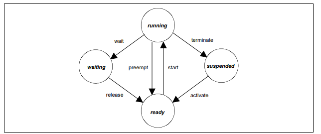
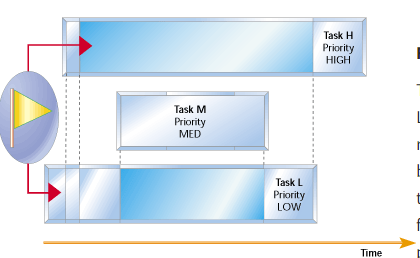
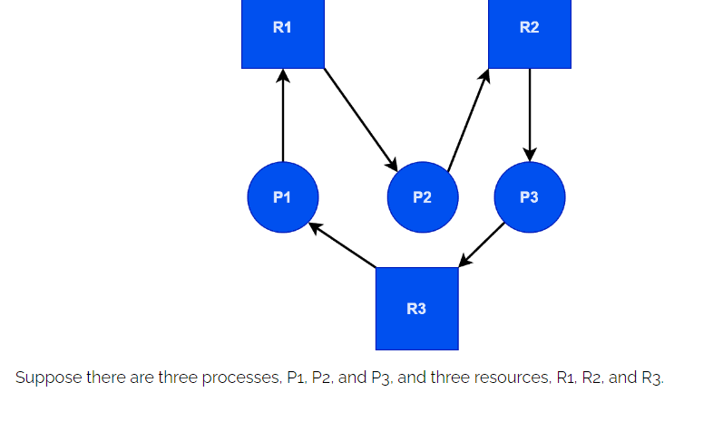
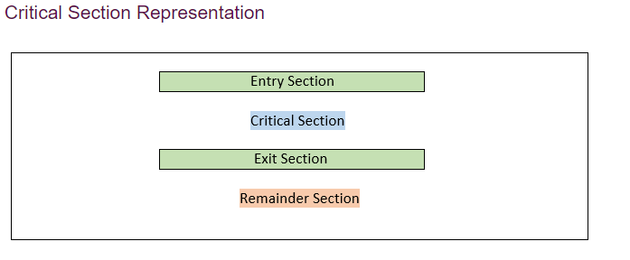
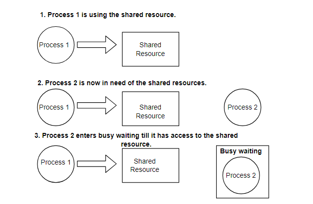
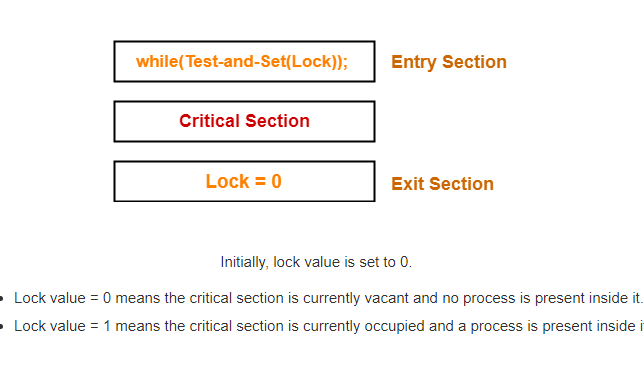
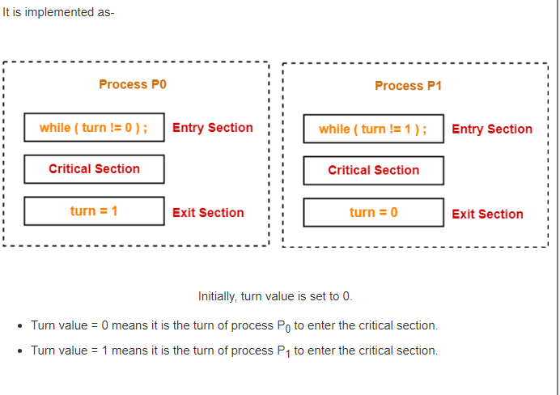
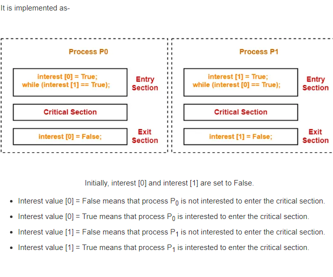
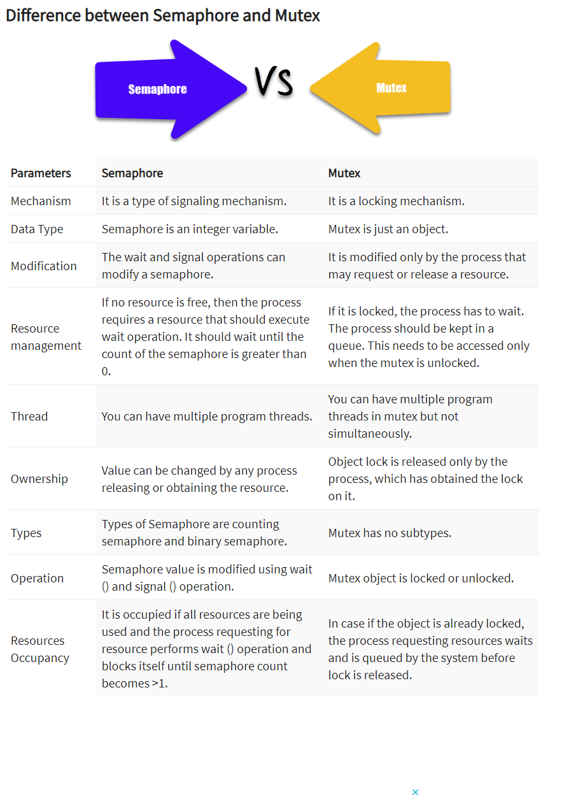

## OSEK

- OSEK stands for "Operating System Embedded Kernel.<br>"

- It is a widely used standard for real-time operating systems (RTOS) in embedded systems.

- OSEK was developed to provide a common standard for automotive electronic control units (ECUs) but has since been adopted in various other industries.

- The specification of the OSEK operating system is to represent a uniform environment which supports efficient utilization of resources for automotive control unit application software.

- The OSEK operating system is a single processor operating system meant for distributed embedded control units.

- OSEK operating system offers the necessary functionality to support event-driven control systems.

- The OSEK operating system serves as a basis for application programs which are independent
  of each other, and provides their environment on a processor. The OSEK operating system
  enables a controlled real-time execution of several processes which appear to run in parallel.

- The OSEK operating system provides a defined set of interfaces for the user. These interfaces
  are used by entities which are competing for the CPU. There are two types of entities:
  • Interrupt service routines managed by the operating system
  • Tasks (basic tasks and extended tasks)
  The hardware resources of a control unit can be managed by operating system services. These
  operating system services are called by a unique interface, either by the application program or
  internally within the operating system.

- OSEK defines three processing levels:
  • Interrupt level
  • Logical level for scheduler
  • Task level
  Within the task level tasks are scheduled (non, full or mixed pre-emptive) according to their
  user assigned priority. The run time context is occupied at the beginning of execution time and
  is released again once the task is finished

## OIL language

OIL (OSEK Implementation Language) is a configuration language used to describe the structure and characteristics of an embedded real-time operating system (RTOS) compliant with the OSEK/VDX standard. OIL files provide a structured way to define the various components of an OSEK-compliant system, such as tasks, resources, events, alarms, and scheduling parameters. These files are typically used by OSEK-compliant RTOS configuration tools to generate the necessary initialization code and configuration data for the target system.

Here's an overview of some of the key components that can be defined in an OIL file:

OSEK Objects: These are the fundamental building blocks of an OSEK-compliant system, such as tasks, resources, events, alarms, counters, and schedules.

Tasks: Tasks represent the executable units of work in the system. In the OIL file, you can specify attributes such as task priority, stack size, and entry point function.

Resources: Resources are used to control access to shared resources in a multitasking environment. OIL allows you to define resources and specify which tasks can access them and under what conditions.

Events: Events are signals used for inter-task communication and synchronization. You can define events in the OIL file and specify which tasks are waiting for them.

Alarms: Alarms are used to trigger actions at specified points in time. You can define alarms in the OIL file and specify which tasks or events they should activate.

Scheduling: OIL allows you to configure the scheduling parameters of the system, such as the scheduling policy (fixed priority, round-robin, etc.), task priorities, and task activation rates.

Other System Parameters: Additionally, OIL files can contain other system parameters, such as stack sizes, interrupt priorities, and memory layout information.

Here is a simple example of an OIL file:

```
CPU test_application {
  OS EE {
    KERNEL_TYPE = BCC1;
    ...
    TASK Task1 {
      PRIORITY = 1;
      STACKSIZE = 256;
    };

    TASK Task2 {
      PRIORITY = 2;
      STACKSIZE = 256;
    };
  };
};

```

# Processing levels are defined for the handling of tasks and interrupt routines as a range of

consecutive value
| Processing Level | Processed Instance |
|------------------|--------------------|
| k...m | Interrupt |
| j | Scheduler |
| 0...i | Task |

1-

## Task concept

- Complex control software can conveniently be subdivided in parts executed according to their
  real-time requirements.

- These parts can be implemented by the means of tasks.

- A task provides the framework for the execution of functions. The operating system provides concurrent and
  asynchronous execution of tasks. The scheduler organises the sequence of task execution.

- Two different task concepts are provided by the OSEK operating system:
  • basic tasks
  • extended tasks

# Basic Tasks

Basic tasks only release the processor, if
• they terminate,
• the OSEK operating system switches to a higher-priority task, or
• interrupt occurs which cause the processor to switch to an interrupt service routine
(ISR).

• The state model of basic tasks is nearly identical to the extended tasks state model. The only
exception is that basic tasks do not have a waiting state.

<br><br>

| Task State | Description                                                                                                                                                                                                                          |
| ---------- | ------------------------------------------------------------------------------------------------------------------------------------------------------------------------------------------------------------------------------------ |
| running    | In the running state, the CPU is assigned to the task, so that its instructions can be executed. Only one task can be in this state at any point in time, while all the other states can be adopted simultaneously by several tasks. |
| ready      | All functional prerequisites for a transition into the running state exist, and the task only waits for allocation of the processor. The scheduler decides which ready task is executed next.                                        |
| suspended  | In the suspended state, the task is passive and can be activated.                                                                                                                                                                    |

<br><br>


<br><br>

| Transition | Former state | New state | Description                                                                                                                                                         |
| ---------- | ------------ | --------- | ------------------------------------------------------------------------------------------------------------------------------------------------------------------- |
| activate   | suspended    | ready     | A new task is set into the ready state by a system service. The OSEK operating system ensures that the execution of the task will start with the first instruction. |
| start      | ready        | running   | A ready task selected by the scheduler is executed.                                                                                                                 |
| preempt    | running      | ready     | The scheduler decides to start another task. The running task is put into the ready state.                                                                          |
| terminate  | running      | suspended | The running task causes its transition into the suspended state by a system service.                                                                                |

<br><br>

# Extended tasks

- They are distinguished from basic tasks by being allowed to use the operating system
  call WaitEvent, which may result in a waiting state
- The waiting state allows the processor to be released and to be
  reassigned to a lower-priority task without the need to terminate the running extended task.

- The OSEK operating system is responsible for saving and restoring task context in
  conjunction with task state transitions whenever necessary

- Extended tasks have four task states:

• running

In the running state, the CPU is assigned to the task, so that its instructions
can be executed. Only one task can be in this state at any point in time, while
all the other states can be adopted simultaneously by several tasks.

• ready
All functional prerequisites for a transition into the running state exist, and
the task only waits for allocation of the processor. The scheduler decides
which ready task is executed next.

• waiting A task cannot continue execution because it has to wait for at least one event
• suspended In the suspended state the task is passive and can be activated.
<br><br>

<br><br>

Transition Former
| Transition | Former State | New State | Description |
|------------|--------------|-----------|-------------|
| activate | suspended | ready | A new task is set into the ready state by a system service. The OSEK operating system ensures that the execution of the task will start with the first instruction. |
| start | ready | running | A ready task selected by the scheduler is executed. |
| wait | running | waiting | The transition into the waiting state is caused by a system service. To be able to continue operation, the waiting task requires an event. |
| release | waiting | ready | At least one event has occurred which a task has waited for. |
| preempt | running | ready | The scheduler decides to start another task. The running task is put into the ready state. |
| terminate | running | suspended | The running task causes its transition into the suspended state by a system service. |

## Scheduling policy

- Non pre-emptive scheduling
  • The scheduling policy is described as non pre-emptive, if task switching is only performed via

• one of a selection of explicitly defined system services (explicit points of rescheduling).
Non pre-emptive scheduling imposes particular constraints on the possible timing requirements
of tasks.
• Specifically the non pre-emptable section of a running task with lower priority delays
the start of a task with higher priority up to the next point of rescheduling.

Implementations of non pre-emptive systems may prescribe that operating system services
which cause rescheduling may only be called at the highest task program level (not in task
subfunctions). Consequently, a task switch at these points of scheduling only requires saving
minimum task context (no stack, only few registers e.g. program counter and/or processor
status).

- Full pre-emptive scheduling

• it means that a task which is presently running may be rescheduled
at any instruction by the occurrence of trigger conditions pre-set by the operating system.

• Full pre-emptive scheduling will put the running task into the ready state, as soon as a higherpriority task has got ready. The task context is saved so that the pre-empted task can be
continued at the location where it was pre-empted.
With full pre-emptive scheduling the latency time is independent of the run time of lower
priority tasks.

• Certain restrictions are related to the increased (RAM-) memory space required
for saving the context, and the enhanced complexity of features necessary for synchronisation
between tasks. As each task can theoretically be rescheduled at any location, access to data
which are used jointly with other tasks must be synchronised.

• In the case of a full pre-emptive system, the user must constantly expect pre-emption of the
running task. If a task fragment must not be pre-empted, this can be achieved by blocking the
scheduler temporarily via the system service GetResource.

- Mixed pre-emptive scheduling
  • If full pre-emptive and non pre-emptive tasks are mixed on the same system, the resulting
  policy is called "mixed pre-emptive" scheduling. In this case scheduling policy depends on preemption properties of running task. If the running task is non pre-emptive, then non preemptive scheduling is performed. If the running task is pre-emptive, then pre-emptive
  scheduling is performed.
  The definition of a non pre-emptive task makes sense in a full pre-emptive operating system,
  • if the execution time of the task is in the same magnitude of the time of a task switch,
  • if RAM is to be used economically to provide space for saving the task context, or
  • if the task must not be pre-empted.
  Many applications comprise only few parallel tasks with a long execution time, for which a full
  pre-emptive operating system would be convenient, and many short tasks with a defined
  execution time where non pre-emptive scheduling would be more efficient. For this configura-

## SCHEDULING ALGORIHMS

- OSEK (Operating System Embedded Kernel) is a specification for real-time operating systems (RTOS) used in embedded systems. It defines a standard for communication, synchronization, and scheduling of tasks in embedded systems. OSEK-compliant operating systems typically employ various scheduling algorithms to manage task execution. Here are some commonly used scheduling algorithms in OSEK-compliant RTOS:

<br><br>
• Fixed-Priority Scheduling (FPS): This is the most common scheduling algorithm used in OSEK-compliant RTOS. Each task is assigned a priority, and tasks are scheduled based on their priority. Higher priority tasks preempt lower priority tasks. Tasks with the same priority are typically scheduled in a first-come-first-served (FCFS) order.
<br><br>

• Rate Monotonic Scheduling (RMS): In RMS, tasks are scheduled based on their period. Shorter period tasks have higher priority. This means that tasks with shorter periods are scheduled more frequently. RMS is optimal for scheduling periodic tasks with known deadlines.
<br><br>

• Earliest Deadline First (EDF): In EDF scheduling, tasks are scheduled based on their deadline. The task with the earliest deadline is scheduled next. EDF scheduling is more flexible than RMS as it can handle aperiodic tasks efficiently.
<br><br>

• Round-Robin Scheduling (RR): Round-robin scheduling allocates CPU time to tasks in a fixed time quantum. Once a task's quantum expires, it is preempted, and the CPU is given to the next task in the ready queue. RR is often used for time-sharing systems and for tasks with similar priority levels.
<br><br>

• Priority Ceiling Protocol (PCP): PCP is a priority inheritance protocol used to prevent priority inversion in systems with shared resources. It ensures that a task cannot be preempted by a task with lower priority while it holds a resource required by the lower priority task. This helps in avoiding deadlock situations.
<br><br>

• Deadline Monotonic Scheduling (DMS): DMS is similar to RMS, but instead of priorities being assigned based on periods, priorities are assigned based on deadlines. Tasks with earlier deadlines have higher priority.

- In this example, we define a system with two tasks, Task1 and Task2, each with their respective priorities and stack sizes.

- OIL files provide a standardized and structured way to configure OSEK-compliant RTOSes, making it easier to develop and maintain embedded systems. They are essential for specifying the behavior and characteristics of an embedded system at a high level of abstraction.

- there is never more than one task share the same resource at the same time

- shared resources should be handled carefully

2-

## Resources

- Any time two tasks share a resource, such as a memory buffer, in a system that employs a priority-based scheduler, one of them will usually have a higher priority.

- The higher-priority task expects to be run as soon as it is ready. However, if the lower-priority task is using their shared resource when the higher-priority task becomes ready to run, the higher-priority task must wait for the lower-priority task to finish with it.

- We say that the higher-priority task is pending on the resource. If the higher-priority task has a critical deadline that it must meet, the worst-case “lockout time” for all of its shared resources must be calculated and taken into account in the design.

## What causes priority inversions?

The real trouble arises at run-time, when a medium-priority task preempts a lower-priority task using a shared resource on which the higher-priority task is pending. If the higher-priority task is otherwise ready to run, but a medium-priority task is currently running instead, a priority inversion is said to occur.

<br><br>


<br><br>

The problem was not in the landing software, but in the mission software run on the Martian surface. In the spacecraft, various devices communicated over a MIL-STD-1553 data bus. Activity on this bus was managed by a pair of high-priority tasks. One of the bus manager tasks communicated through a pipe with a low-priority meteorological science task.

## Solutions

- Priority inheritance
  <br>
  This technique mandates that a lower-priority task inherit the priority of any higher-priority task pending on a resource they share. This priority change should take place as soon as the high-priority task begins to pend; it should end when the resource is released. This requires help from the operating system.

- Priority ceilings
  <br>
  The second solution, priority ceilings, associates a priority with each resource; the scheduler then transfers that priority to any task that accesses the resource. The priority assigned to the resource is the priority of its highest-priority user, plus one. Once a task finishes with the resource, its priority returns to normal.

A beneficial feature of the priority ceiling solution is that tasks can share resources simply by changing their priorities, thus eliminating the need for semaphores:

```
void TaskA(void)
{
  ...	SetTaskPriority(RES_X_PRIO);	// Access shared resource X.
SetTaskPriority(TASK_A_PRIO);	...
}
```

While Task A’s priority is elevated (and it is accessing shared resource X), it should not pend on any other resource. The higher-priority user will only become the highest-priority ready task when the lower-priority task is finished with their shared resource.

While not all of us are writing software for missions to Mars, we should learn from past mistakes and implement solutions that don’t repeat them. Many commercial RTOSes include support for either priority inheritance or priority ceilings. Just make sure you enable one.

## Deadlock

- A deadlock can occur in almost any situation where processes share resources. It can happen in any computing environment, but it is widespread in distributed systems, where multiple processes operate on different resources.

- In this situation, one process may be waiting for a resource already held by another process. Deadlock is similar to a chicken and egg problem.

<br><br>



<br><br>

Now, suppose P1 requests a resource R2, which is held by P2. In such a case, P1 won’t proceed without R2 and will wait indefinitely because P2 can’t release resource 2 until it gets R3, which P3 holds. The same is true for P1 and P3.

## Deadlock can arise if the following four conditions hold simultaneously:

- The first condition is mutual exclusion. In this condition, we can’t share a resource among the different processes at the same time.

For example, if two people want to print a paper simultaneously, this process can not be done. One has to wait until the system releases the print (resource). Thus, we can assign a resource to only one process at a time.

- The second necessary condition for deadlock is the hold and wait or resource holding. In this condition, a process simultaneously holds at least one resource and waits for another resource at a time. Here, the process is not in the running state. It’s in a waiting state.

- The third condition is no preemption. If a process holds a resource, then the resource can not be taken away forcefully from the process until it releases the resource. This statement also holds when the process is in a waiting state.

- The final condition for deadlock is the circular wait. Let’s assume the process P1 is waiting for a resource R2. Now that particular resource R2 is already held by a process P2. Process P2 is waiting for the resource, held by the next process. This will continue until the last process is waiting for the resource held by the first process.

The circular wait condition creates a circular chain and puts all the processes in a waiting state.

## Deadlock Prevention

 <br>
In the deadlock prevention process, the OS will prevent the deadlock from occurring by avoiding any one of the four conditions that caused the deadlock. If the OS can avoid any of the necessary conditions, a deadlock will not occur.

- No Mutual Exclusion
  It means more than one process can have access to a single resource at the same time. It’s impossible because if multiple processes access the same resource simultaneously, there will be chaos. Additionally, no process will be completed. So this is not feasible. Hence, the OS can’t avoid mutual exclusion.

Let’s take a practical example to understand this issue. Jack and Jones share a bowl of soup. Both of them want to drink the soup from the same bowl and use a single spoon simultaneously, which is not feasible.

- No Hold and Wait
  To avoid the hold and wait, there are many ways to acquire all the required resources before starting the execution. But this is also not feasible because a process will use a single resource at a time. Here, the resource utilization will be very less.

Before starting the execution, the process does not know how many resources would be required to complete it. In addition to that, the bus time, in which a process will complete and free the resource, is also unknown.

Another way is if a process is holding a resource and wants to have additional resources, then it must free the acquired resources. This way, we can avoid the hold and wait condition, but it can result in starvation.

- Removal of No Preemption
  One of the reasons that cause the deadlock is the no preemption. It means the CPU can’t take acquired resources from any process forcefully even though that process is in a waiting state. If we can remove the no preemption and forcefully take resources from a waiting process, we can avoid the deadlock. This is an implementable logic to avoid deadlock.

For example, it’s like taking the bowl from Jones and give it to Jack when he comes to have soup. Let’s assume Jones came first and acquired a resource and went into the waiting state. Now when Jack came, the caterer took the bowl from Jones forcefully and told him not to hold the bowl if you are in a waiting state.

- Removal of Circular Wait
  In the circular wait, two processes are stuck in the waiting state for the resources which have been held by each other. To avoid the circular wait, we assign a numerical integer value to all resources, and a process has to access the resource in increasing or decreasing order.

## When is the scheduler triggered?

<br>

| Operation         | Preemptive | Nonpreemptive |
|-------------------|------------|---------------|
| Activate Task     |     x      |               |
| Terminate Task    |     x      |      x        |
| Wait Event        |     x      |      x        |
| Chaining Task     |     x      |      x        |
| Get Resource      |            |               |
| Release Resource  |     x      |               |
| Scheduler         |     x      |      x        |
| ISR               |     x      |               |


<br>

3-

## Hooks

<br>
<br>
hook functions refer to special functions provided by the RTOS that developers can implement to customize and extend the behavior of the operating system. These hook functions are called by the RTOS in response to specific events or system conditions. They allow developers to add application-specific logic or perform system-level tasks at key points in the execution of the operating system.

There are several common types of hook functions that RTOSes might provide:

- Task Hooks: These hooks are called when tasks are created, started, suspended, resumed, preempted, or terminated. They allow developers to perform actions such as initializing task-specific data structures or logging task state transitions.

- Interrupt Hooks: These hooks are called when interrupts occur, either before or after the interrupt service routine (ISR) is executed. They allow developers to perform actions such as logging interrupt occurrences or performing additional processing before or after servicing the interrupt.

- Error Hooks: These hooks are called when errors or exceptional conditions occur within the RTOS, such as stack overflows, resource allocation failures, or deadline misses. They allow developers to implement custom error handling or recovery mechanisms.

- Idle Task Hooks: These hooks are called when the CPU is idle and no tasks are ready to execute. They allow developers to implement power-saving features or perform background tasks during idle periods.

- Startup and Shutdown Hooks: These hooks are called during system startup and shutdown, allowing developers to perform initialization or cleanup tasks before the application starts executing or after it finishes.

Here's a simplified example of how hook functions might be defined in a typical RTOS configuration:

```
void taskStartupHook(TaskType taskID) {
    // Perform task-specific initialization
}

void taskTerminationHook(TaskType taskID) {
    // Perform cleanup tasks when task terminates
}

void errorHook(StatusType error) {
    // Handle errors or exceptional conditions
}

void idleTaskHook(void) {
    // Perform background tasks during idle periods
}

int main() {
    // Configure RTOS to use hook functions
    configureTaskStartupHook(taskStartupHook);
    configureTaskTerminationHook(taskTerminationHook);
    configureErrorHook(errorHook);
    configureIdleTaskHook(idleTaskHook);

    // Start RTOS scheduler
    startScheduler();

    return 0;
}
```

<br>
<br>

4-

## Counters

- Tick per base
- Maximum allowed value
- Minimum cycle

Counters in real-time operating systems (RTOS) are used to track time or count events. They are often essential for implementing time-based services such as task scheduling, timeouts, and alarms. Here are some key parameters associated with counters in an RTOS:

- Tick per Base (Tick Frequency): This parameter defines the resolution of the counter, i.e., how often the counter increments. It represents the smallest time interval that the RTOS can measure or track. For example, if the tick per base is set to 1 millisecond, the counter will increment every millisecond. The choice of tick per base depends on the desired system timing accuracy and the application's real-time requirements.

- Maximum Allowed Value: This parameter specifies the maximum value that the counter can reach before it wraps around or resets. The maximum allowed value determines the range of time or events that the counter can represent. It is crucial to choose a maximum allowed value that accommodates the longest time duration or the highest event count expected in the application without overflowing.

- Minimum Cycle: This parameter indicates the smallest interval between consecutive activations of an event controlled by the counter. It defines the minimum time period or event frequency that the counter can support. For example, if a periodic task needs to be activated every 100 milliseconds, the minimum cycle of the counter should be set to 100 milliseconds to ensure accurate timing.

In an RTOS, counters are typically configured during system initialization or through configuration files such as OIL files (OSEK Implementation Language files). Here's an example of how counters might be defined in an OIL file for an OSEK-compliant RTOS:

<br><br>

```
COUNTER SystemCounter {
  MINCYCLE = 1; // Minimum cycle of 1 tick
  MAXALLOWEDVALUE = 1000; // Maximum allowed value of 1000 ticks
  TICKSPERBASE = 1; // Tick per base is 1 millisecond
};
```

<br><br>

In this example, SystemCounter is defined with a tick per base of 1 millisecond (TICKSPERBASE = 1), a maximum allowed value of 1000 ticks (MAXALLOWEDVALUE = 1000), and a minimum cycle of 1 tick (MINCYCLE = 1). This configuration ensures that the counter increments every millisecond and can represent time intervals up to 1000 milliseconds with a resolution of 1 millisecond.

5-

## alarms are used to schedule actions or events to occur at specific points in time. There are two common ways to specify the time for an alarm: absolute time and relative time.

- Absolute Time:
  <br>
  <br>
  With absolute time, the alarm is scheduled to occur at a specific, fixed point in time relative to a reference point, such as the system startup time or the current time. The absolute time is usually represented as a timestamp, which includes information about the date and time when the alarm should trigger. When the alarm is set with absolute time, the RTOS calculates the delay between the current time and the specified absolute time and schedules the alarm accordingly.
**Example:** If the current time is 10:00 AM, and an absolute-time alarm is set to trigger at 11:00 AM, the RTOS will calculate the delay of one hour and schedule the alarm to trigger after one hour has elapsed.

- **Relative Time:**

  With relative time, the alarm is scheduled to occur after a certain duration or interval relative to the current time. The relative time is specified as a duration or offset from the current time. When the alarm is set with relative time, the RTOS calculates the absolute time when the alarm should trigger based on the current time and the specified relative duration.

  **Example:** If the current time is 10:00 AM, and a relative-time alarm is set to trigger after 30 minutes, the RTOS will calculate the absolute time when the alarm should trigger as 10:30 AM.

Both absolute time and relative time have their use cases:

- Absolute time is useful when events need to occur at specific, predetermined times, such as scheduled system maintenance or recurring tasks that need to happen at fixed intervals (e.g., daily backups at midnight).

- Relative time is useful when events need to occur after certain durations or intervals, such as timeouts, delays, or periodic tasks with fixed intervals relative to the current time.

---

## Race Condition

- **Race Condition in Multi Threading Scenario**

  A race condition is a situation that develops when many threads share a resource or execute the same piece of code in a multithreaded context. Inappropriate handling of this might result in an unfavorable scenario where the output state depends on the threads execution order.

- **Race Condition in Multi Processing Scenario**

  The Race Condition is a situation that is developed when a device or system tries to do two or more operations simultaneously when, due to the nature of the device or system, the actions must be performed in the right order to be performed successfully; a race condition is an unpleasant circumstance that results.
## Critical Section Area

- <span style="color:red">The Critical Section Problem is a Code Snippet. This code snippet contains a few variables. These variables can be accessed by a few processes. There is a condition for these processes.</span>

- <span style="color:red">The condition is that only one process can only enter the critical section. Remaining Processes which are interested to enter the critical section have to wait for the process to complete its work and then enter the critical section.</span>

- <span style="color:red">The portion of a piece of code that is performed by many threads is considered in critical section of a code. The critical section area is vulnerable to a race condition because various outputs from concurrently running threads potentially result in different orders of execution.</span>
<br><br>


<br><br>

# Any solution to the critical section problem must satisfy three requirements:

 <span style="color:red">
- **Mutual Exclusion**
</span>
   Exclusive access of each process to the shared memory. Only one process can be in its critical section at any given time.
<span style="color:red">
- **Progress**
</span>
    If no process is in its critical section, and if one or more threads want to execute their critical section then any one of these threads must be allowed to get into its critical section.
 <span style="color:red">
- **Bounded Waiting**
</span>

   After a process makes a request for getting into its critical section, there is a limit for how many other processes can get into their critical section before this process's request is granted. So after the limit is reached, the system must grant the process permission to get into its critical section. The purpose of this condition is to make sure that every process gets the chance to actually enter its critical section so that no process starves forever.

There are two general approaches to waiting in operating systems:

- Firstly, a process/task can continuously check for the condition to be satisfied while consuming the processor – **busy waiting**.

- Secondly, a process can wait without consuming the processor. In such a case, the process/task is alerted or awakened when the condition is satisfied. The latter is known as sleeping, blocked waiting, or sleep waiting "non-busy waiting".


-  Disabling all Interrupts is another approach, By disabling interrupts, the processor prevents any interrupts from being serviced until they are re-enabled. This ensures that the critical section executes without interruption.
"Not Used" as Disabling interrupts introduces additional latency in handling hardware interrupts, as interrupts must remain disabled until critical sections are completed. This latency can impact the responsiveness of the system to external events or interrupts.


    <br><br>

    | Requirement      | Satisfied |
    | ---------------- | --------- |
    | Mutual Exclusion | ✔         |
    | Progress         | ✔         |
    | Bounded Limit    | ✔         |
    <br><br>


What Is Busy Waiting?

Busy waiting, also known as spinning or busy looping, is a process synchronization technique in which a process/task waits and constantly checks for a condition to be satisfied before proceeding with its execution. In busy waiting, a process executes instructions that test for the entry condition to be true, such as the availability of a lock or resource in the computer system.

For resource availability, consider a scenario where a process needs a resource for a specific program. However, the resource is currently in use and unavailable at the moment, therefore the process has to wait for resource availability before it can continue. This is what is known as busy waiting as illustrated below:
<br><br>


<br><br>

 <span style="color:red">

## Busy Waiting Techniques
</span>


1- LOCK variable<br>

2- T & S  <br>

3- Strict Alternation  <br>

4- Interested Variables  <br>

5- Peterson's Algorithm <br><br>


 <span style="color:blue">

lock variable
</span>
  - it provides the simplest synchronization mechanism for processes. Some noteworthy points regarding Lock Variables are:

    - It's a software mechanism implemented in user mode, i.e., no support required from the Operating System.
    - It's a busy waiting solution (keeps the CPU busy even when it's technically waiting).
    - It can be used for more than two processes.

    When Lock = 0 implies the critical section is vacant (initial value) and Lock = 1 implies the critical section is occupied. The pseudocode looks something like this:

<br><br>
    | Task 0             | Task 1             |
    | ------------------ | ------------------ |
    | //Entry section -  | //Entry section -  |
    | while(lock != 0);  | while(lock != 0);  |
    | Lock = 1;          | lock=1;            |
    | //critical section | //critical section |
    | Exit section -     | Exit section -     |
    | Lock = 0;          | lock=0;            |
 <br><br>

    - This method is hardware independent.
    <br><br>

    | Requirement      | Satisfied |
    | ---------------- | --------- |
    | Mutual Exclusion | X         |
    | Progress         | ✔         |
    | Bounded Limit    | X         |
    <br><br>

- In some operating systems, busy waiting can be inefficient because the looping procedure is a waste of computer resources. In addition, the system is left idle while waiting. This is particularly wasteful if the task/process at hand is of low priority. In that case, resources that can be diverted to complete high-priority tasks are hogged by a low-priority task in busy waiting.

- A workaround solution for the inefficiency of busy waiting that is implemented in most operating systems is the use of a delay function. Also known as a sleep system call, a delay function places the process involved in busy waiting into an inactive state for a specified amount of time. In this case, resources are not wasted as the process is "asleep".

 <span style="color:blue">

# T&S "Test and Set"
</span>

- It uses a test and set instruction to provide synchronization among the processes executing concurrently.
<br><br>


<br><br>

This synchronization mechanism works as explained in the following scenes:

- **Scene-01:**

    Process P0 arrives.
    <br>
    It executes the test-and-set(Lock) instruction.<br>
    Since the lock value is set to 0, it returns value 0 to the while loop and sets the lock value to 1.<br>
    The returned value 0 breaks the while loop condition.<br>
    Process P0 enters the critical section and executes.<br>
    Now, even if process P0 gets preempted in the middle, no other process can enter the critical section.<br>
    Any other process can enter only after process P0 completes and sets the lock value to 0.<br>

- **Scene-02:**

    Another process P1 arrives.<br>
    It executes the test-and-set(Lock) instruction.<br>
    Since the lock value is now 1, it returns value 1 to the while loop and sets the lock value to 1.<br>
    The returned value 1 does not break the while loop condition.<br>
    The process P1 is trapped inside an infinite while loop.<br>
    The while loop keeps the process P1 busy until the lock value becomes 0 and its condition breaks.<br>

- **Scene-03:**

    Process P0 comes out of the critical section and sets the lock value to 0.<br>
    The while loop condition breaks.<br>
    Now, process P1 waiting for the critical section enters the critical section.<br>
    Now, even if process P1 gets preempted in the middle, no other process can enter the critical section.<br>
    Any other process can enter only after process P1 completes and sets the lock value to 0.<br>

# Characteristics

The characteristics of this synchronization mechanism are:

- It ensures mutual exclusion.<br>
- It is deadlock-free.<br>
- It does not guarantee bounded waiting and may cause starvation.<br>
- It suffers from spin lock.<br>
- It is not architectural neutral "Hardware dependent" since it requires the operating system to support the test-and-set instruction by locking the data bus to support atomic instructions.<br>
- It is a busy waiting solution that keeps the CPU busy when the process is actually waiting.<br>
<br><br>

| Requirement      | Satisfied |
| ---------------- | --------- |
| Mutual Exclusion | ✔         |
| Progress         | ✔         |
| Bounded Limit    | X         |
<br><br>

 <span style="color:blue">

# Strict Alternation
</span>

- Turn variable is a synchronization mechanism that provides synchronization among two processes.
It uses a turn variable to provide the synchronization.
 

It is implemented as-

<br><br>

<br><br>

- Scene-01:
 

Process P0 arrives.<br>
It executes the turn!=0 instruction.<br>
Since turn value is set to 0, so it returns value 0 to the while loop.<br>
The while loop condition breaks.<br>
Process P0 enters the critical section and executes.<br>
Now, even if process P0 gets preempted in the middle, process P1 can not enter the critical section.<br>
Process P1 can not enter unless process P0 completes and sets the turn value to 1.<br>
 

- Scene-02:
 


Process P1 arrives.<br>
It executes the turn!=1 instruction.<br>
Since turn value is set to 0, so it returns value 1 to the while loop.<br>
The returned value 1 does not break the while loop condition.<br>
The process P1 is trapped inside an infinite while loop.<br>
The while loop keeps the process P1 busy until the turn value becomes 1 and its condition breaks.<br>
 

- Scene-03:
 

Process P0 comes out of the critical section and sets the turn value to 1.<br>
The while loop condition of process P1 breaks.<br>
Now, the process P1 waiting for the critical section enters the critical section and execute.<br>
Now, even if process P1 gets preempted in the middle, process P0 can not enter the critical section.<br>
Process P0 can not enter unless process P1 completes and sets the turn value to 0.<br>
 

 

<br><br>

| Requirement      | Satisfied |
| ---------------- | --------- |
| Mutual Exclusion | X         |
| Progress         | X         |
| Bounded Limit    | ✔         |
<br><br>


# Interested Variables
<br>
- Interest variable is a synchronization mechanism that provides synchronization among two processes.<br>

- It uses an interest variable to provide the synchronization.
<br>
<br>


<br>
<br>


# Working-
 
<br>

This synchronization mechanism works as explained in the following scenes-


<br>

# Scene-01:
 

Process P0 arrives.<br>

It sets interest[0] = True.<br>

Now, it executes while loop condition- interest [1] == True.<br>

Since interest [1] is initialized to False, so it returns value 0 to the while loop.<br>

The while loop condition breaks.<br>
Process P0 enters the critical section and executes.<br>
Now, even if process P0 gets preempted in the middle, process P1 can not enter the critical section.<br>
Process P1 can not enter unless process P0 completes and sets the interest [0] = False.<br>
 
<br>

# Scene-02:
 

<br>

Process P1 arrives.<br>
It sets interest[1] = True.<br>
Now, it executes while loop condition- interest [0] == True.<br>
Process P0 has already shown its interest by setting interest [0] = True.<br>
So, it returns value 1 to the while loop.<br>
The while loop condition satisfies.<br>
The process P1 is trapped inside an infinite while loop.<br>
The while loop keeps the process P1 busy until the interest [0] value becomes False and its condition breaks.<br>
 <br>


# Scene-03:
 

Process P0 comes out of the critical section and sets the interest [0] value to False.<br>
The while loop condition of process P1 breaks.<br>
Now, the process P1 waiting for the critical section enters the critical section and execute.<br>
Now, even if process P1 gets preempted in the middle, process P0 can not enter the critical section.<br>
Process P0 can not enter unless process P1 completes and sets the interest [1] = False.<br>
 

## Characteristics-
 

The characteristics of this synchronization mechanism are-


It ensures mutual exclusion.<br>
It does not follow strict alternation approach.<br>
It ensures progress since if a process is not interested to enter the critical section, it never stops the other process to enter the critical section.<br>
It is architectural neutral since it does not require any support from the operating system.<br>
It is a busy waiting solution which keeps the CPU busy when the process is actually waiting.<br>
It suffers from deadlock.<br>
Since it suffers from deadlock, it does not guarantee bounded waiting.<br>
 

 # How it suffers from deadlock?
 

This synchronization mechanism may cause deadlock between the processes.<br>
Deadlock may occur through the following sequence of scenes-
 

# Scene-01:
 

Process P0 arrives.<br>
It sets interest[0] = True.<br>
Now, it gets preempted and process P1 gets scheduled.<br>
 

# Scene-02:
 

Process P1 arrives.<br>
It sets interest[1] = True.<br>
Now, it gets preempted.<br>
 

# Scene-03:
 

Process P0 gets scheduled again.<br>
Now, it can not break the while loop condition- interest [1] == True since process P1 has shown its interest for executing critical section before its arrival.<br>
It keeps waiting in the infinite while loop for process P1 to complete its execution first.<br>
 

# Scene-04:
 

Later, Process P1 gets scheduled again.<br>
Now, it also can not break the while loop condition- interest [0] == True since process P0 is also interested for executing critical section.<br>
It keeps waiting in the infinite while loop for process P0 to complete its execution first.<br>
Thus, both the processes are deadlocked.<br>

<br>

# Peterson's Algorithm
<br>
<br>
- Peterson’s Algorithm is used to synchronize two processes. It uses two variables, a bool array flag of size 2 and an int variable turn to accomplish it.<br>

- In the solution, i represents the Consumer and j represents the Producer. Initially, the flags are false. When a process wants to execute it’s critical section, it sets its flag to true and turn into the index of the other process.<br>

- This means that the process wants to execute but it will allow the other process to run first. The process performs busy waiting until the other process has finished it’s own critical section. <br>

- After this, the current process enters its critical section and adds or removes a random number from the shared buffer.<br>
 - After completing the critical section, it sets it’s own flag to false, indicating it does not wish to execute anymore. <br>

 Let's consider two processes, P0 and P1, that both want to access a shared resource.
<br><br>
```
bool flag[2] = {false, false};
int turn = 0; // turn indicates whose turn it is to access the resource
```
<br><br>

# Process 0
```
//Entry Section

flag[0] = true; // P0 is interested in accessing the critical section
turn = 1; // It's P1's turn
while (flag[1] && turn == 1) {
    // Wait until P1 is not interested or it's P0's turn
}
// Critical Section

// Exit Section
flag[0] = false; // P0 is no longer interested
```
<br><br>

# Process 1
```
//Entry Section

flag[0] = true; // P1 is interested in accessing the critical section
turn = 1; // It's P1's turn
while (flag[1] && turn == 0) {
    // Wait until P1 is not interested or it's P1's turn
}
// Critical Section

// Exit Section
flag[1] = false; // P1 is no longer interested
```


Peterson's Algorithm is used to synchronize two processes. It uses two variables, a bool array flag of size 2 and an int variable turn to accomplish it.

In the solution, i represents the Consumer and j represents the Producer. Initially, the flags are false. When a process wants to execute its critical section, it sets its flag to true and turn into the index of the other process.

This means that the process wants to execute but it will allow the other process to run first. The process performs busy waiting until the other process has finished its own critical section.

After this, the current process enters its critical section and adds or removes a random number from the shared buffer.

After completing the critical section, it sets its own flag to false, indicating it does not wish to execute anymore.

Let's consider two processes, P0 and P1, that both want to access a shared resource.
<br>
<br>

# Scenario for Peterson's Algorithm

  Process P0 arrives.<br>
  It sets interest[0] = True.<br>
  Now, it gets preempted and process P1 gets scheduled.<br>

  Process P1 arrives.<br>
  It sets interest[1] = True.<br>
  Now, it gets preempted.<br>

  Process P0 gets scheduled again.<br>
  Now, it can not break the while loop condition - interest[1] == True since process P1 has shown its interest for executing critical section before its arrival.<br>
  It keeps waiting in the infinite while loop for process P1 to complete its execution first.<br>
  Later, Process P1 gets scheduled again.<br>
  Now, it also can not break the while loop condition - interest[0] == True since process P0 is also interested in executing the critical section.<br>
  It keeps waiting in the infinite while loop for process P0 to complete its execution first.<br>
  Thus, both the processes are deadlocked.<br>

<br><br>

    | Requirement      | Satisfied |
    | ---------------- | --------- |
    | Mutual Exclusion | ✔         |
    | Progress         | ✔         |
    | Bounded Limit    | ✔         |

<br><br>

# Characteristics
<br>
- Architecture neutral<br>


- Supports N processes<br>


<br>

## NoN-Busy Waiting Techniques
<br>

- Sleep and Wakeup<br>

- Rather than having a process spin around and around,
checking if it can proceed into the critical section, suppose
we implement some mechanism whereby it sends itself to
sleep and then is awoken only when there is a chance it
can proceed.<br>
- Functions such as sleep() and wakeup() are often
available via a threading library or as kernel service calls.
Let’s explore this idea


Sleep and wakeup (also known as wait and signal) are fundamental operations used in process synchronization to coordinate the execution of multiple processes or threads. These operations are commonly employed in concurrency models to allow processes to wait for certain conditions to be met before proceeding.<br>

# Sleep Operation (Wait):

The sleep operation allows a process to voluntarily suspend its execution and wait for a particular condition to become true.<br>
When a process invokes the sleep operation, it relinquishes the CPU and enters a blocked state, allowing other processes to execute.<br>
Typically, the sleep operation is associated with a condition or event that the process is waiting for.<br> The process remains in the blocked state until another process signals that the condition has occurred 
Wakeup Operation (Signal):

The wakeup operation is used to signal or notify a sleeping process that a particular condition it was waiting for has occurred.<br>
When a process invokes the wakeup operation, it unblocks the sleeping process, allowing it to resume execution.<br>
The wakeup operation is often associated with the fulfillment of a condition or the occurrence of an event that was being waited upon by one or more processes.

<br><br>

```
bool condition = false;

// Function executed by the waiting process
void waiting_process() {
    // Loop until the condition is fulfilled
    while (!condition) {
        // Sleep operation - block the process until condition becomes true
        sleep();
    }
    // Proceed with execution after the condition is fulfilled
}

// Function executed by the signaling process
void signaling_process() {
    // Perform some work
    // ...

    // Fulfill the condition
    condition = true;

    // Wakeup operation - signal the waiting process that the condition is fulfilled
    wakeup();
}
```
<br><br>


1-  SLeep              means  Waiting state
2-  Wakeup             means  Ready state
3-  critical section   means  Running State

<br><br>
typedef struct {
    int value;             // Value of the semaphore
    Queue Q:
} s;

<br><br>

```
//Entry
wait();
//cs
//Exit
Signal();

```
<br><br>


wait()
{

    if(s.value==1)
    s.value=0;

    else
    {
        //put the PCB in the queue
        sleep();
    }

signal()

{

    if(s.Q is empty())
    s.value=1;
    else
    {

        //get a [rocess frpm the queue ]
        wakeup();
    }
}
}

<br>
<br>

## What is Semaphore?
<br>

- Semaphore is simply a variable that is non-negative and shared between threads.<br>

- A semaphore is a signaling mechanism, and a thread that is waiting on a semaphore can be signaled by another thread.<br>
 - It uses two atomic operations, 1)wait, and 2) signal for the process synchronization.<br>


A semaphore either allows or disallows access to the resource, which depends on how it is set up.<br>


## What is Mutex?
<br>

- The full form of Mutex is Mutual Exclusion Object. It is a special type of binary semaphore which used for controlling access to the shared resource. <br>

- It includes a priority inheritance mechanism to avoid extended priority inversion problems. <br>

- It allows current higher priority tasks to be kept in the blocked state for the shortest time possible. However, priority inheritance does not correct priority- inversion but only minimizes its effect.<br>


## Use of Semaphore
<br>

- In the case of a single buffer, we can separate the 4 KB buffer into four 1 KB buffers. Semaphore can be associated with these four buffers. This allows users and producers to work on different buffers at the same time.

## Use of Mutex
<br>

A mutex provides mutual exclusion, which can be either producer or consumer that can have the key (mutex) and proceed with their work. As long as producer fills buffer, the user needs to wait, and vice versa. In Mutex lock, all the time, only a single thread can work with the entire buffer.

<br>
<br>



<br>
<br>

## Counting Semaphore
<br>
- There are the scenarios in which more than one processes need to execute in critical section simultaneously. However, counting semaphore can be used when we need to have more than one process in the critical section at the same time.

<br><br>

```
struct Semaphore  
{  
    int value; // processes that can enter in the critical section simultaneously.   
    queue type L; // L contains set of processes which get blocked   
}  
wait (Semaphore S)  
{  
    SS.value = S.value - 1; //semaphore's value will get decreased when a new   
    //process enter in the critical section   
    if (S.value< 0)  
    {  
        put_process(PCB) in L; //if the value is negative then   
        //the process will get into the blocked state.  
        Sleep();   
    }  
    else  
        return;  
}  
signal (Semaphore s)  
{  
    SS.value = S.value+1; //semaphore value will get increased when   
    //it makes an exit from the critical section.   
    if(S.value<=0)  
    {  
        select a process from L; //if the value of semaphore is positive   
        //then wake one of the processes in the blocked queue.   
        wake-up();  
    }  
    }  
 
```
<br><br>

- In this mechanism, the entry and exit in the critical section are performed on the basis of the value of counting semaphore. The value of counting semaphore at any point of time indicates the maximum number of processes that can enter in the critical section at the same time.

<br><br>

- A process which wants to enter in the critical section first decrease the semaphore value by 1 and then check whether it gets negative or not. If it gets negative then the process is pushed in the list of blocked processes (i.e. q) otherwise it gets enter in the critical section.